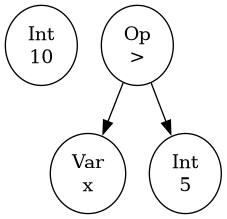

# INE5426-Compiladores

Este projeto é um compilador desenvolvido para a disciplina INE5426 - Compiladores. 
Ele realiza análise léxica, sintática, semântica e gera código intermediário para uma linguagem de programação didática.
A linguagem escolhida foi **Java**.

## Funcionalidades
- **Análise Léxica:** Identifica tokens e erros léxicos.
- **Análise Sintática:** Constrói a AST e detecta erros de sintaxe.
- **Análise Semântica:** Verifica declarações, tipos, escopos e gera uma árvore de escopos com tabelas de símbolos.
- **Geração de Código Intermediário:** Produz uma representação intermediária do código.

## Como Executar

1. **Compilar o projeto:**
   ```sh
   make
   ```
2. **Executar o compilador com um arquivo de entrada:**
   ```sh
   make run FILE=resources/instances/test/dimensions.txt
   ```
   Substitua o caminho após `FILE=` pelo arquivo de entrada desejado.

   **Exemplo:**
   ```sh
   make run FILE=resources/instances/test/simpleCode1.txt
     ```
   
   Para visualizar as **Árvores de Expressão** em um formato de imagem, adicione `ARGS=--showTree` ao comando `make run`
   
   ```sh
   make run FILE=resources/instances/test/dimensions.txt ARGS=--showTree
   ```
   Mesmo sem essa flag, as árvores de expressão são exibidas no terminal, mas graficamente elas são mais fáceis de entender.

   Segue um exemplo:
   ```sh
       make run FILE=resources/instances/test/simpleCode1.txt ARGS=--showTree
   ```
   Código do `simpleCode1.txt`:

   ```txt
   def main(){
       int x;
       x = 10;
       if (x > 5){
           print x;
       }
   }
   ```
   
    Imagem gerada:

    


## Exemplos de entrada
Veja exemplos em `resources/instances/test` para testar diferentes aspectos do compilador. 
Os arquivos que possuem mais que 100 linhas estão no diretório: `resources/instances/program`, e 
para executá-los, basta utilizar o(s) seguinte(s) comando(s):


```sh
  make run FILE=resources/instances/program/aluno.txt
```
```sh
  make run FILE=resources/instances/program/art.txt
```
```sh
  make run FILE=resources/instances/program/fabric.txt
```
**OBS**: Lembre-se de adicionar ARGS=--showTree para visualizar as Árvores de Expressão.

## Detalhes de implementação
- **Análise Léxica**: O autômato utilizado para a etapa de Análise Léxica está localizado em `resources/automaton.json`. 
Esse autômato foi gerado usando uma ferramenta externa.

## Autores  
- Gabriela Regina Lother
- Ismael Coral Hoepers Heinzelmann
- Lucas Castro Truppel Machado
- Lucas Coelho Pini de Sousa
- Tiago Faustino de Siqueira

---

